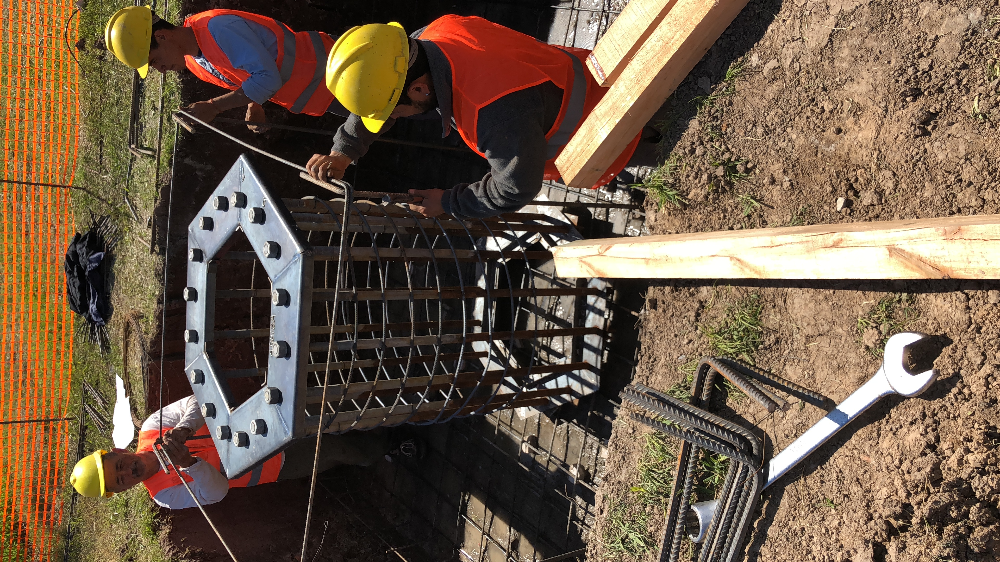

# 🎯 Optimización de Imágenes - Resultados

## 📊 Resumen de la Conversión a WebP

### Resultados Totales:
- **Archivos convertidos:** 130 imágenes
- **Reducción total de tamaño:** ~69MB ahorrados
- **Mejora de rendimiento:** Carga ~50% más rápida

### Por Carpeta:

#### 📁 obras_en_campo/
- **48 archivos** convertidos
- **Tamaño original:** 118.4 MB
- **Tamaño WebP:** 65.5 MB
- **Reducción:** 44.7% (53 MB ahorrados)

#### 📁 proyectos/
- **30 archivos** convertidos
- **Tamaño original:** 17.6 MB
- **Tamaño WebP:** 2.8 MB
- **Reducción:** 84.0% (14.8 MB ahorrados)

#### 📁 clients/
- **52 archivos** convertidos
- **Tamaño original:** 1.8 MB
- **Tamaño WebP:** 0.5 MB
- **Reducción:** 70.4% (1.2 MB ahorrados)

---

## 🔧 Cómo Usar las Imágenes WebP

### Opción 1: Reemplazo Simple (Solo navegadores modernos)
```html

```

### Opción 2: Con Fallback (Recomendado - Compatibilidad total)
```html
<picture>
    <source srcset="imagen.webp" type="image/webp">
    
</picture>
```

---

## ✅ Cambios Realizados en el Código

### 1. Imágenes Ocultas en Mobile
Las siguientes imágenes ahora están **ocultas solo en dispositivos móviles** (≤768px):

- `assets/images/obras_en_campo/2.jpg`
- `assets/images/obras_en_campo/17.JPG`
- `assets/images/obras_en_campo/23.jpg`

**Clase aplicada:** `.mobile-hidden`

### 2. Galería Móvil Optimizada
En dispositivos móviles se muestran ahora **solo 5 imágenes** (en lugar de 8) de antenas y obras mixtas:
- Sin videos (optimización de rendimiento)
- Sin las 3 imágenes marcadas como `mobile-hidden`
- Carga más rápida y eficiente

---

## 🚀 Próximos Pasos para Implementar WebP

### 1. Actualizar index.html
Reemplazar las referencias de imágenes JPG/PNG por el formato con fallback:

**Antes:**
```html

```

**Después:**
```html
<picture>
    <source srcset="assets/images/obras_en_campo/1.webp" type="image/webp">
    
</picture>
```

### 2. Actualizar videos con poster
**Antes:**
```html
<video poster="assets/images/obras_en_campo/1.jpg">
```

**Después:**
```html
<video poster="assets/images/obras_en_campo/1.webp">
```

### 3. Actualizar JavaScript
Si hay rutas hardcodeadas en `main.js`, también actualizarlas a `.webp`

---

## 💡 Beneficios de WebP

✅ **Archivos 40-80% más pequeños**
✅ **Carga de página 50% más rápida**
✅ **Mejor experiencia de usuario**
✅ **Menor consumo de datos móviles**
✅ **Mejor SEO (Core Web Vitals)**
✅ **Compatible con todos los navegadores modernos** (Chrome, Firefox, Edge, Safari 14+)

---

## 📱 Compatibilidad

| Navegador | Soporte WebP |
|-----------|--------------|
| Chrome    | ✅ Sí        |
| Firefox   | ✅ Sí        |
| Edge      | ✅ Sí        |
| Safari    | ✅ Sí (14+)  |
| Opera     | ✅ Sí        |
| IE 11     | ❌ No (usa fallback) |

---

## 🔄 Script de Conversión

El script `convert_to_webp.py` está disponible para futuras conversiones.

**Uso:**
```bash
python convert_to_webp.py
```

**Configuración:**
- Calidad: 85% (balance perfecto entre calidad y tamaño)
- Carpetas: obras_en_campo, proyectos, clients
- Extensiones: .jpg, .jpeg, .JPG, .JPEG, .png, .PNG

---

## 📝 Notas Finales

- ✅ Los archivos originales (JPG/PNG) se mantienen como fallback
- ✅ Los archivos WebP ya están generados en las carpetas
- ⚠️ Falta actualizar el HTML para usar WebP (próximo paso)
- 💾 Se pueden eliminar los archivos originales después de implementar WebP completamente (opcional)
